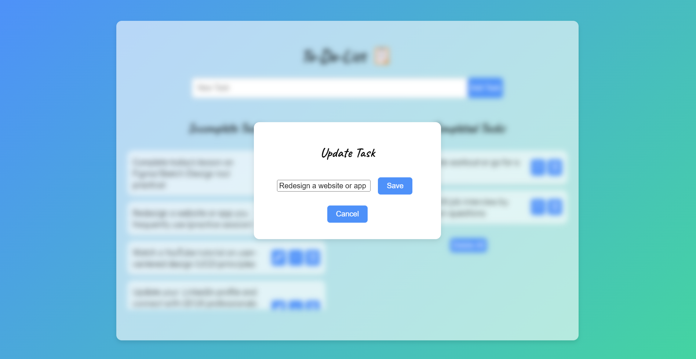

# To-Do List Application

## Overview

This project is a **To-Do List Web Application** built using HTML, CSS, and JavaScript. It provides an intuitive interface for users to manage their daily tasks efficiently. The application reflects modern UI/UX design practices and demonstrates the implementation of **state-of-the-art frontend technologies**. The interface is designed to ensure ease of use, allowing users to add, update, complete, and delete tasks with seamless interactivity.

## UI Design

- **Front Page of the To-do-list**

- **Update Pop-up of the To-do-list**

  

## Features

- **Responsive UI Design**: The application is fully responsive, providing an optimal viewing experience across various devices, from desktops to mobile screens.
- **Task Management**: Users can easily manage tasks through options to add new tasks, update existing ones, delete tasks, or mark them as complete/incomplete.
- **Icon-Based Interaction**: Buttons are enhanced with **Font Awesome icons**, improving the visual clarity and user engagement.
- **Modal Dialog for Updates**: Users can modify their tasks in a user-friendly modal popup, ensuring a streamlined task editing process.
- **Task Completion Toggle**: Users can mark tasks as complete or incomplete with a single click, providing clear task management.
- **Clear Completed Tasks**: A dedicated button allows users to clear all completed tasks at once, ensuring a clutter-free interface.

## Tech Stack

## Tech Stack

      

